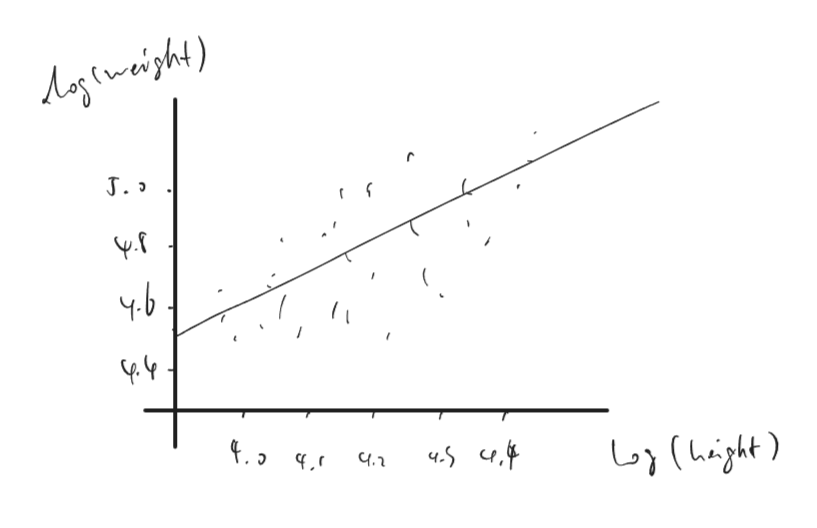

```{r setup, include=FALSE}
knitr::opts_chunk$set(echo = TRUE)
pacman::p_load("bayesplot","knitr","arm","ggplot2","rstanarm","dplyr","tidyverse")
remotes::install_github("avehtari/ROS-Examples", subdir = "rpackage")
```

## 11.5 
*Residuals and predictions*: The folder `Pyth` contains outcome $y$ and predictors $x_1$, $x_2$ for 40 data points, with a further 20 points with the predictors but no observed outcome. Save the file to your working directory, then read it into R using `read.table()`.

### (a) 
Use R to fit a linear regression model predicting $y$ from $x_1$, $x_2$, using the first 40 data points in the file. Summarize the inferences and check the fit of your model.

```{r}
library(rosdata)
data(pyth)
fit_1<-lm(y ~ x1 + x2,data = pyth[1:40,])
summary(fit_1)
#both x1 and x2 are significant, R square is also close to 1. 
```

### (b) 
Display the estimated model graphically as in Figure 10.2

```{r}
plot(pyth$x1[1:40],pyth$y[1:40],xlab = 'x1',ylab = 'y')
abline(coef(fit_1)[1]+coef(fit_1)[3]*mean(pyth$x2[1:40]),coef(fit_1)[2])
plot(pyth$x2[1:40],pyth$y[1:40],xlab = 'x2',ylab = 'y')
abline(coef(fit_1)[1]+coef(fit_1)[2]*mean(pyth$x1[1:40]),coef(fit_1)[3])
```

### (c) 
Make a residual plot for this model. Do the assumptions appear to be met?

```{r}
plot(fit_1, which = 1)
```


### (d) 
Make predictions for the remaining 20 data points in the file. How confident do you feel about these predictions?

```{r}
pyth_1 <- data.frame(x1 = pyth$x1[41:60], x2 = pyth$x2[41:60])
predict(fit_1, pyth_1)
#confidencial result based on a)
```


## 12.5 
*Logarithmic transformation and regression*: Consider the following regression:
$$\log(\text{weight})=-3.8+2.1 \log(\text{height})+\text{error,} $$
with errors that have standard deviation 0.25. Weights are in pounds and heights are in inches.

### (a) 
Fill in the blanks: Approximately 68% of the people will have weights within a factor of __0.78____ and __1.28____ of their predicted values from the regression.

### (b) 
Using pen and paper, sketch the regression line and scatterplot of log(weight) versus log(height) that make sense and are consistent with the fitted model. Be sure to label the axes of your graph.

```{r}
data(earnings)
summary(earnings)
log(57);log(80);log(342);log(66);log(150)

```


## 12.6 
*Logarithmic transformations*: The folder `Pollution` contains mortality rates and various environmental factors from 60 US metropolitan areas. For this exercise we shall model mortality rate given nitric oxides, sulfur dioxide, and hydrocarbons as inputs. this model is an extreme oversimplication, as it combines all sources of mortality and does not adjust for crucial factors such as age and smoking. We use it to illustrate log transformation in regression.  

### (a) 
Create a scatterplot of mortality rate versus level of nitric oxides. Do you think linear regression will fit these data well? Fit the regression and evaluate a residual plot from the regression.

```{r}
data(pollution)
head(pollution)
fit_126 <- lm(pollution$mort ~ pollution$nox)
ggplot(pollution)+
  geom_point(mapping = aes(nox,mort))+
  geom_abline(intercept = coef(fit_126)[1], slope = coef(fit_126)[2]) +
  theme_classic()
plot(fit_126,which = 1)
```

### (b) 
Find an appropriate reansformation that will result in data more appropriate for linear regression. Fit a regression to the transformed data and evaluate the new residual plot.

```{r}
pollution$lg_mort <- log(pollution$mort)
pollution$lg_nox <- log(pollution$nox)
fit_126b <- lm(pollution$lg_mort ~ pollution$lg_nox)
ggplot(pollution)+
  geom_point(mapping = aes(lg_nox,lg_mort))+
  geom_abline(intercept = coef(fit_126b)[1], slope = coef(fit_126b)[2]) +
  theme_classic()
plot(fit_126b,which = 1)
```

### (c) 
Interpret the slope coefficient from the model you chose in (b)

A 1% increase in height will averagely results in 0.15% increase in weight.

### (d) 
Now fit a model predicting mortality rate using levels of nitric oxides, sulfur dioxide, and hydrocarbons as inputs. Use appropriate transformation when helpful. Plot the fitted regression model and interpret the coefficients.

```{r}
# using log() instead
pollution$lg_so2 <- log(pollution$so2)
pollution$lg_hc <- log(pollution$hc)
fit_126d <- lm(pollution$lg_mort ~ pollution$lg_nox + pollution$lg_so2 + pollution$lg_hc)
mean <- c(1, mean(pollution$lg_nox), mean(pollution$lg_so2), mean(pollution$lg_hc))
c <- coef(fit_126d)
ggplot(pollution)+
  geom_point(mapping = aes(lg_nox,lg_mort))+
  geom_abline(intercept = c[1] + mean[3]*c[3] + mean[4]*c[4], slope = c[2]) +
  theme_classic()
ggplot(pollution)+
  geom_point(mapping = aes(lg_so2,lg_mort))+
  geom_abline(intercept = c[1] + mean[2]*c[2] + mean[4]*c[4], slope = c[3]) +
  theme_classic()
ggplot(pollution)+
  geom_point(mapping = aes(lg_hc,lg_mort))+
  geom_abline(intercept = c[1] + mean[2]*c[2] + mean[3]*c[3], slope = c[4]) +
  theme_classic()
```

### (e) 
Cross validate: fit the model you chose above to the first half of the data and then predict for the second half. You used all the data to construct the model in (d), so this is not really cross validation, but it gives a sense of how the steps of cross validation can be implemented.

```{r}
fit_126e <- lm(pollution$lg_mort[1:30] ~ pollution$lg_nox[1:30] + pollution$lg_so2[1:30] + pollution$lg_hc[1:30])
pred <- data.frame(x1 = pollution$lg_nox[31:60], x2 = pollution$lg_so2[31:60], x3 = pollution$lg_hc[31:60])
predict(fit_126e, pred)
```

## 12.7 
*Cross validation comparison of models with different transformations of outcomes*: when we compare models with transformed continuous outcomes, we must take into account how the nonlinear transformation warps the continuous outcomes. Follow the procedure used to compare models for the mesquite bushes example on page 202.

### (a) 
Compare models for earnings and for log(earnings) given height and sex as shown in page 84 and 192. Use `earnk` and `log(earnk)` as outcomes.

```{r}
data(earnings)
fit_127a <- stan_glm(earnk ~ height + male, data = earnings, refresh = 0)
fit_127b <- stan_glm(log(earnk[earnk!=0]) ~ height[earnk!=0] + male[earnk!=0], data = earnings, refresh = 0)
#adding if/else due to the missing values
loo(fit_127a)
loo(fit_127b)
```

### (b) 
Compare models from other exercises in this chapter.
```{r}
loo(fit_126)
loo(fit_126b)
```


## 12.8 
*Log-log transformations*: Suppose that, for a certain population of animals, we can predict log weight from log height as follows:  

* An animal that is 50 centimeters tall is predicted to weigh 10 kg.

* Every increase of 1% in height corresponds to a predicted increase of 2% in weight.

* The weights of approximately 95% of the animals fall within a factor of 1.1 of predicted values.

### (a) 
Give the equation of the regression line and the residual standard deviation of the regression.

log(weight)=-5.521461 + 2*log(height) residual standard deviation: 0.05


### (b) 
Suppose the standard deviation of log weights is 20% in this population. What, then, is the $R^{2}$ of the regression model described here?  

0.8, 80% of animals is fitted instead of 95%, approximately.

## 12.9 
*Linear and logarithmic transformations*: For a study of congressional elections, you would like a measure of the relative amount of money raised by each of the two major-party candidates in each district. Suppose that you know the amount of money raised by each candidate; label these dollar values $D_i$ and $R_i$. You would like to combine these into a single variable that can be included as an input variable into a model predicting vote share for the Democrats. Discuss the advantages and disadvantages of the following measures:  

### (a) 
The simple difference, $D_i - R_i$

easy to interpret, both for coefficient and interception, however, the difference in dollar amount might not fully convey the real difference considering the totals.

### (b) 
The ratio, $D_i / R_i$

easy to interpret, but hard to interpret the interception since it can not be zero

### (c) 
The difference on the logarithmic scale, $\log D_i - \log R_i$   

better than a)

### (d) 
The relative proportion, $D_{i}/(D_{i}+R_{i})$. 

better than b), but has the same weakness(intercept)

## 12.11
*Elasticity*: An economist runs a regression examining the relations between the average price of cigarettes, $P$, and the quantity purchased, $Q$, across a large sample of counties in the United  States, assuming the functional form, $\log Q=\alpha+\beta \log P$. Suppose the estimate for $\beta$ is 0.3.  Interpret this coefficient. 

1% increase in average price is averagely associated with an 0.3 increase in the quantity purchased of cigarettes.

## 12.13
*Building regression models*: Return to the teaching evaluations data from Exercise 10.6. Fit regression models predicting evaluations given many of the inputs in the dataset. Consider interactions, combinations of predictors, and transformations, as appropriate. Consider several  models, discuss in detail the final model that you choose, and also explain why you chose it rather than the others you had considered. 

```{r}
data
head(beauty)
fit_1213a <- lm(eval ~ beauty + female + age + female*age,data=beauty)
summary(fit_1213a)
fit_1213b <- lm(log(eval) ~ beauty + female + age + female*age,data=beauty )
summary(fit_1213b)

# choosing log(eval) instead.There is no clear difference between the two except for the residuals. Using log provides more normalized residuals,
```


## 12.14
Prediction from a fitted regression: Consider one of the fitted models for mesquite leaves, for example `fit_4`, in Section 12.6. Suppose you wish to use this model to make inferences about the average mesquite yield in a new set of trees whose predictors are in data frame called  new_trees. Give R code to obtain an estimate and standard error for this population average. You do not need to make the prediction; just give the code. 

```{r}
data(mesquite)
head(mesquite)
fit_1214 <- stan_glm(formula = weight ~ diam1 + diam2 + canopy_height +
total_height + group + density, data=mesquite, refresh = 0)

```
